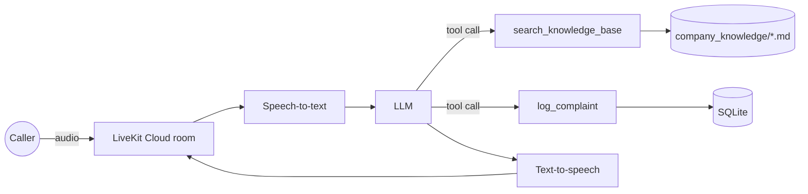

# SACCO Voice Support Agent

A real-time voice AI support agent for a savings and credit cooperative (SACCO), built with [LiveKit Agents](https://docs.livekit.io/agents) in Python.

It answers member questions **only from approved documents**, records complaints through a **validated tool** with deterministic routing and rate limits, and refuses to invent products or collect sensitive information.

> All company data in this repo is **fictional** ("Chuma SACCO"). The agent is designed to be configured for any institution by swapping its knowledge files and settings.

**Live demo:** an access-protected web frontend is deployed. The access link is available on request.

---

## What it does

| Capability | How |
|---|---|
| Answers product and policy questions | `search_knowledge_base` tool: keyword retrieval over markdown documents, with contextual chunking (`Product > Section`) |
| Declines what it doesn't know | Product catalogue + prompt rules + section labels, so it says "we don't offer that" instead of inventing |
| Records complaints | `log_complaint` tool: Pydantic validation, Malawi phone normalisation, reference numbers, routing by code |
| Routes urgent cases | Fraud, data-protection and staff-conduct complaints go to Risk & Compliance as urgent; this is decided in code, not by the LLM |
| Limits abuse | Max 3 complaints per phone number per local (UTC+2) day; fraud and data-protection reports are never blocked |
| Protects members | Refuses PINs, passwords and one-time codes; never calculates loan costs or judges eligibility; discloses that it is automated |

## Architecture



The business logic (`knowledge.py`, `complaints.py`) is plain Python with no LiveKit imports, so it can be reused by other agent frameworks or channels and tested in isolation.

## Key design decisions

- **Code decides what must be reliable.** Routing, rate limits, validation and reference numbers are deterministic Python. The LLM decides *when* to use a tool, not *what the rules are*.
- **Tools are contracts.** The agent only sees `search_knowledge_base(query)` and `log_complaint(...)`. Keyword search can be replaced by vector search, and SQLite by Postgres, without changing the tools.
- **Validation errors are feedback.** When a tool call is invalid, the tool returns what to fix, so the agent asks the member again instead of failing.
- **Fail closed.** The agent refuses to start without its knowledge folder; the frontend refuses tokens without a valid access code.
- **Personal data stays out of logs.** Tools log reference numbers and categories, never names, phone numbers or questions.

## Testing and evaluation

- **28 automated tests** (`pytest`) covering retrieval, chunking, validation, routing, reference numbers, SQL-injection safety, daily limits and time-zone boundaries
- **CI on every push** (Ruff linting and formatting)
- **Findings log** ([`docs/Findings.md`](docs/Findings.md)): failures observed in real test calls, with cause, risk and fix

Selected findings:

| Finding | Status |
|---|---|
| Agent invented a "car loan" by applying one product's terms to another | Fixed in three layers: contextual chunking, prompt rules, product catalogue |
| Agent promised to "use the number you're calling from" (a capability it doesn't have) | Fixed with explicit capability rules |
| Intermittent silent replies (TTS p95 of 12 s) | Traced to a provider concurrency limit exhausted by pooled connections and a hung session shutdown; documented capacity limits |
| Docker image built with a different Python version than runtime, rebuilding the environment on every cold start | Fixed by aligning the base image with `.python-version` |
| PIN digits appear in transcripts and logs before the agent can refuse them | **Open:** needs PII redaction in code (planned) |
| End-to-end latency ~4–5 s | **Open:** above the target for voice; tuning planned against a measured baseline |

## Project structure

```
src/
  agent.py          # Agent, prompt builder, tools, session setup
  knowledge.py      # Document loading, contextual chunking, keyword search
  complaints.py     # Complaint model, routing, reference numbers, storage, limits
tests/              # pytest suite
company_knowledge/  # Fictional SACCO documents (products, loan, complaints process)
docs/Findings.md    # Findings log from real test calls
Dockerfile          # Container build used for LiveKit Cloud deployment
```

## Run locally

Requires [uv](https://docs.astral.sh/uv/), the [LiveKit CLI](https://docs.livekit.io/intro/basics/cli/) and a LiveKit Cloud project.

```bash
uv sync
cp .env.example .env.local      # then fill in your values (never commit .env.local)
uv run pytest
lk agent dev
```

Settings (see `.env.example`):

| Variable | Purpose |
|---|---|
| `LIVEKIT_URL`, `LIVEKIT_API_KEY`, `LIVEKIT_API_SECRET` | LiveKit project credentials |
| `COMPANY_NAME` | Name used in the greeting and prompt |
| `COMPLAINTS_DB` | Path to the complaints database (default `data/complaints.db`) |
| `DISABLE_NOISE_CANCELLATION` | Set to `true` on slow development machines only |

## Deploy

```bash
lk agent create --secrets-file .env.deploy   # first time
lk agent deploy                              # updates
```

## Roadmap

- Postgres and vector search (pgvector) behind the existing tool contracts
- PII redaction before logging and recording
- Calculator tool so loan costs are computed by tested code, never by the LLM
- Automated behaviour evaluations from the findings log
- Latency tuning against the measured baseline
- Telephony and SMS confirmation of complaint references

## Credits

Built on LiveKit's [agent-starter-python](https://github.com/livekit-examples/agent-starter-python) template (MIT licence).

Built by **Daniel Kasambala**: [GitHub](https://github.com/DILHT) · [Portfolio](https://danielkasambala.netlify.app)